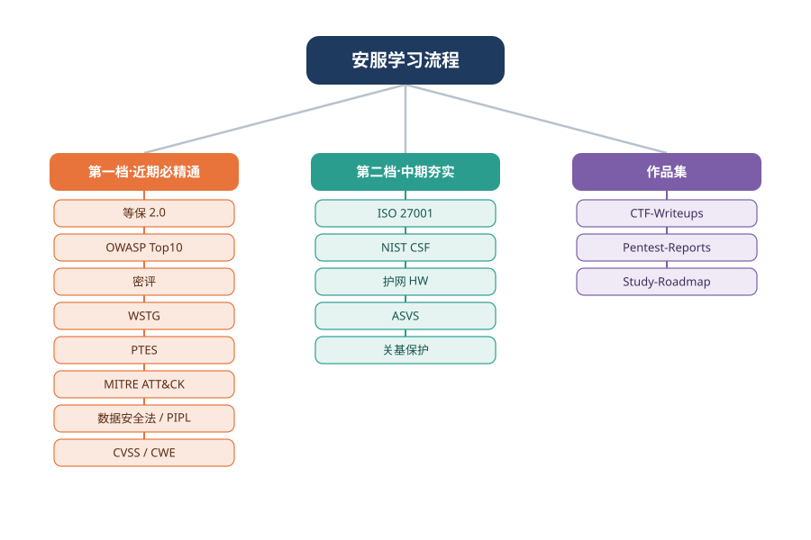

# SinghYY 🛡️

网络安全方向27届学生，专注 **Web 安全 / 应急响应 / 等保测评 / 蓝队监测**。

## 技能栈

| 方向 | 技能 |
|---|---|
| Web 安全 | SQL 注入、XSS、文件上传、一句话木马 |
| 应急响应 | 日志分析、网页篡改处置、攻击溯源 |
| 流量分析 | Redis / MySQL 流量取证 |
| 编程 | Python（安全脚本）、Java、PHP |
| CTF | Misc / Web |

## 作品集导航

| 仓库 | 内容 |
|---|---|
| [CTF-Writeups](https://github.com/SinghYY/CTF-Writeups) | CTF 题解集 |
| [Pentest-Reports](https://github.com/SinghYY/Pentest-Reports) | 渗透测试报告 |
| [Incident-Response-Reports](https://github.com/SinghYY/Incident-Response-Reports) | 网络安全应急响应报告（网页篡改处置） |
| [Security-Study-Roadmap](https://github.com/SinghYY/Security-Study-Roadmap) | 网络安全校招备考分档路线图（等保+应急方向） |
| [asset-collection-workflow](https://github.com/SinghYY/asset-collection-workflow) | 资产收集分级工作流（合规优先的资产收集工具，Python） |

### 重点项目：资产收集分级工作流

面向**授权安全测试**（安全服务 / SRC 漏洞挖掘）的资产收集工具。

与常见收集工具的区别：把「对象定级 → 分级管控 → 熔断保护 → 审计留痕」的安服方法论固化进流程 —— 先定级，工具再按等级自动限速、对高敏感目标强制特批，探测异常时自动熔断停止。

- **分级管控**：四级对象定级驱动探测速率与审批门槛，高敏感对象强制单独特批
- **熔断保护**：连续超时或被 WAF 拦截达阈值即停止全部主动探测（设计原则「只停不绕」）
- **全程留痕**：审计日志逐步记录，API Key 自动脱敏
- **零依赖**：Python 标准库实现，Web + CLI 双模式

> 仓库：[asset-collection-workflow](https://github.com/SinghYY/asset-collection-workflow) ｜ 配套 SOP 文档：P0–P6 流程 · 分级操作矩阵 · 开工前合规检查清单

## 个人学习路线脑图

> 图形化思维导图：中心为「安服学习流程」，三大分支分别为 **第一档·近期必精通**、**第二档·中期夯实**、**作品集**。仓库跳转见上方「作品集导航」表格。

## 正在推进

- [x] 搭建本作品集
- [x] [DC-1 渗透测试完整报告](https://github.com/SinghYY/Pentest-Reports/tree/main/Vulnhub-DC-1)
- [x] [资产收集分级工作流](https://github.com/SinghYY/asset-collection-workflow)（Python 工具，已开源）
- [ ] 护网蓝队方向实战积累
- [ ] CTF 持续刷题中
